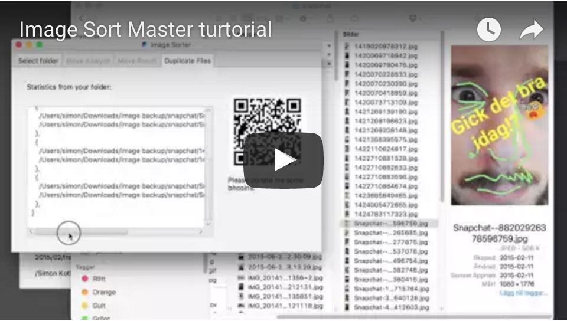
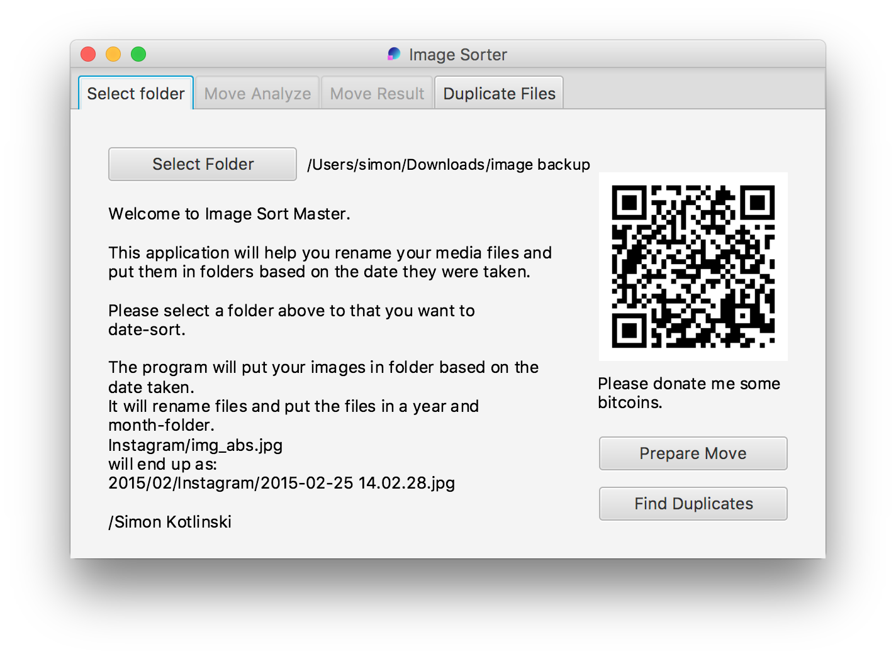
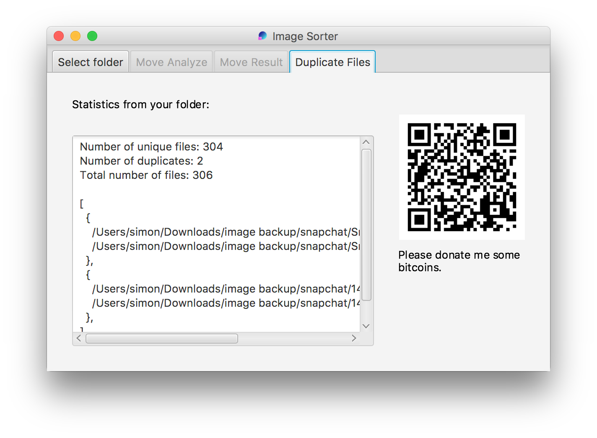
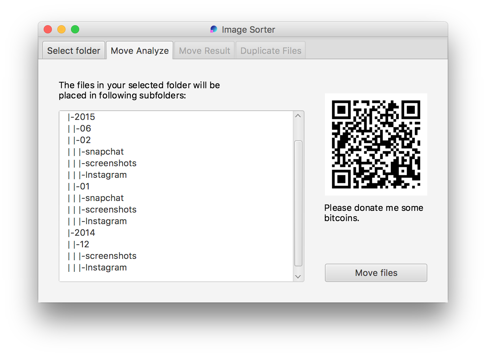
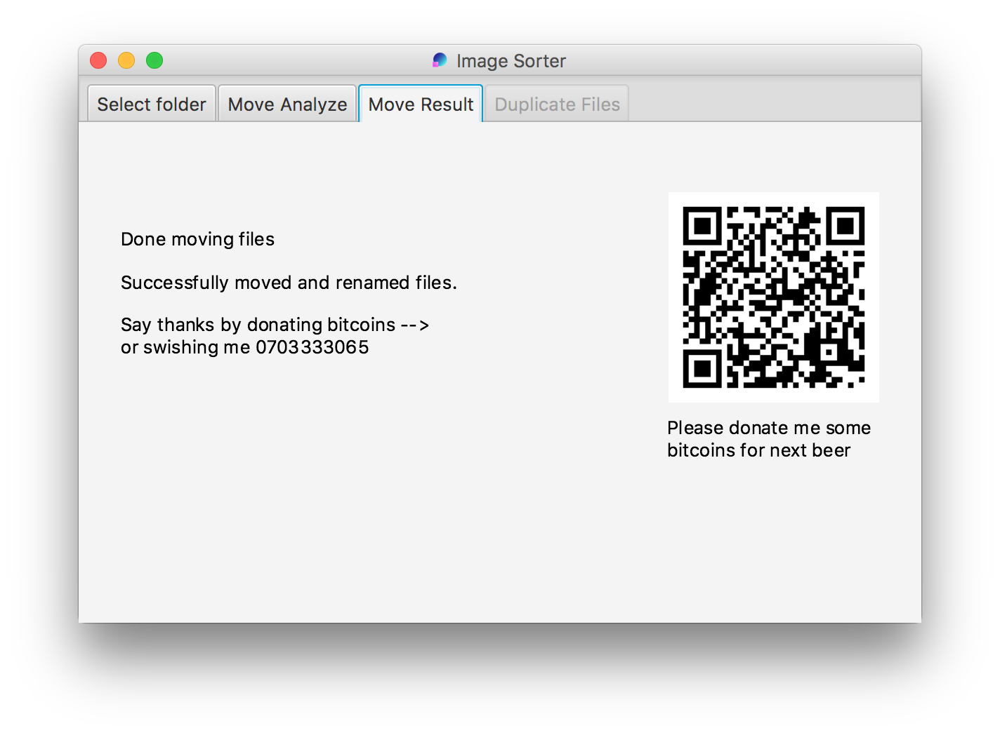

Image Sort Master
============

[](https://travis-ci.org/kotlinski/image-sort-master) [](https://coveralls.io/r/kotlinski/image-sort-master)

Purpose
--------

How and when do you sort and back up your images from your camera-devices? 

I have my images stored on a few hard drive backups, Dropbox and various devices;
My Dropbox, my Nexus 6p and my old devices(Nexus 5 and Samsung Galaxy). The problem is that
Dropbox, Nexus 5 and Samsung all have their own way of naming the images and their 
storage's always get full at different points of time. Dropbox gets full once in a year,
my phone every two or three months, or sometimes, devices get wasted. 

Over time it gets hard to detect duplicates and you don't bother delete poor-
quality images, because you know that it may exist in at least one more location.

With this tool your images will be sorted and renamed in this structure:
<br>
`year/[month(optional)]/<flavour(existing folder structure)>/yyyy-mm-dd hh.mm.ss.[png|jpg|mp4]`
<br>
The month setting is optional. 
The flavor may be Instagram, Screenshots, Elins wedding or what folder you
put your images in.<br>
A flavor is all sub folders from the root folder, except year/month.
<br>Example:<br>
`root-folder/2013/Wedding/TheKiss/imgA.png`
 <br>will be sorted as:<br> 
`root-folder/2013/04/Wedding/TheKiss/2013-04-22 13.17.00.png`
<br>
The application will detect all duplicate files and merge them into one when possible.

Tutorial
--------
[](https://www.youtube.com/watch?v=L2TtF-VDhnk)


Downloads
--------

Mac:  https://www.dropbox.com/s/qs220167u1yki41/Image%20Sorter-5.0.0.pkg?dl=1

Windows: https://www.dropbox.com/s/9hp8zgkgl9qkwsc/Image%20Sorter-5.0.0.msi?dl=1


Donate
--------
Bitcoin address `36h3FR2xqVZg14TASLMPvDfETBDziUb1oo`


A real life situation
--------
<br>
<b>Images from phone</b>

-  <b>Camera</b>
    -  cam_ImgA.png
    -  cam_ImgB.png
-  <b>Instagram</b>
    -  insta_ImgA.png
	  -  insta_ImgB.png
-  <b>Screenshots</b>
    -  scrn_ShtA.png
	  -  scrn_ShtB.png

<br><br>
<b>Images from Dropbox</b>

-  <b>Camera Uploads</b>
    -  <b>Elins Wedding</b>
      -  image_A.png
      -  image_C.png
    -  image_D.png
    
 
The application will help you merge the result into this:
<br>
<br>
<b>My Image Back up</b>

-  <b>2012</b>
    -  <b>02</b>
        -  <b>Camera</b>
        -  <b>Instagram</b>
        -  <b>Screenshots</b>

-  <b>2013</b>
    -  <b>12</b>
        -  2013.12.23-12.23.png
            
As you see, the images will be sorted in folders depending on when the images were
taken. If the images were placed in a special folder they will be inherited 
to the new structure.

The Output-folder will be updated if you want to complement with new images.


How to build and use it
--------

### Setup the project
Make a runnable bat with:  <br>
`  > ./gradlew installApp` <br>
`  > build/install/image-clients/bat/image-clients.bat -h` <br>


To run unit and integration test* run: <br> 
`  > ./gradlew clean build` <br>
To only run unit or integration tests: <br>
`  > ./gradlew clean build -x integrationTest` <br>
`  > ./gradlew clean build -x test` <br>
 *_integration tests mainly tests the public interfaces with as few mocks as possible and images 
 from the file system etc. Unit tests uses many mockes and focused on internal logic in package only
 methods._

A guide for splitting up unit and integration tests in gradle: 
[Integration Testing With the TestSets Plugin](http://www.petrikainulainen.net/programming/gradle/getting-started-with-gradle-integration-testing-with-the-testsets-plugin/)

The project also provides code coverage data, that can be found after a build in: 
_image-clinets/build/jacoco/_. The jacoco code-coverage-files can be imported with 
Intellij in _Analyze > Show coverage data..._


### Command-line interface

```
 -h,--help           print help
 -s,--source <arg>   Folder to 'image sort'
```


### GUI 

The gui in version 5.

Select folder


Detect duplicates


Move files (Preview)





Road map
--------

- [x] use image meta-data interpreters. 
- [x] use some kind of mp4-meta data parser
- [x] take an input folder and generate new folders from meta data
- [x] use dependency injection, (Guice etc)
- [x] add automatic builds
- [x] create a simple gui selecting two folders(input/output)
- [x] present the results of duplicates etc.
- [x] take care of output folder on update
- [x] print out new file structure as default, add parameter to execute
- [ ] add parameter list of flavours not should be accepted. 

